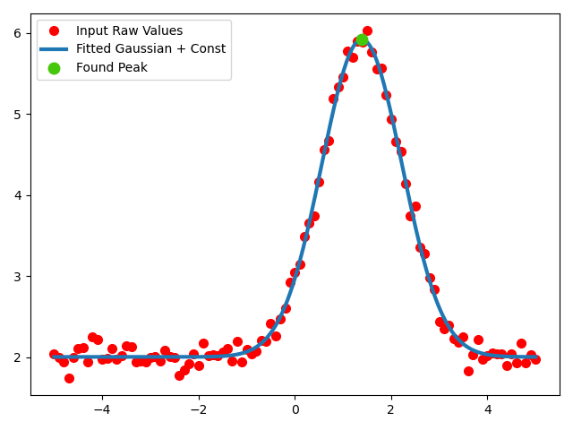
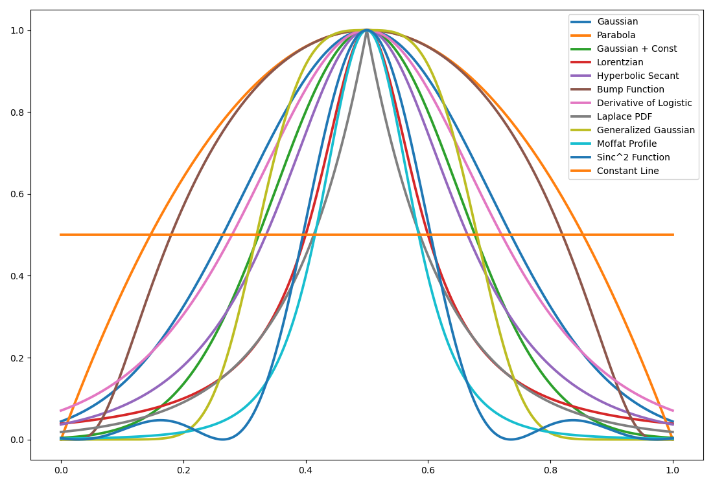
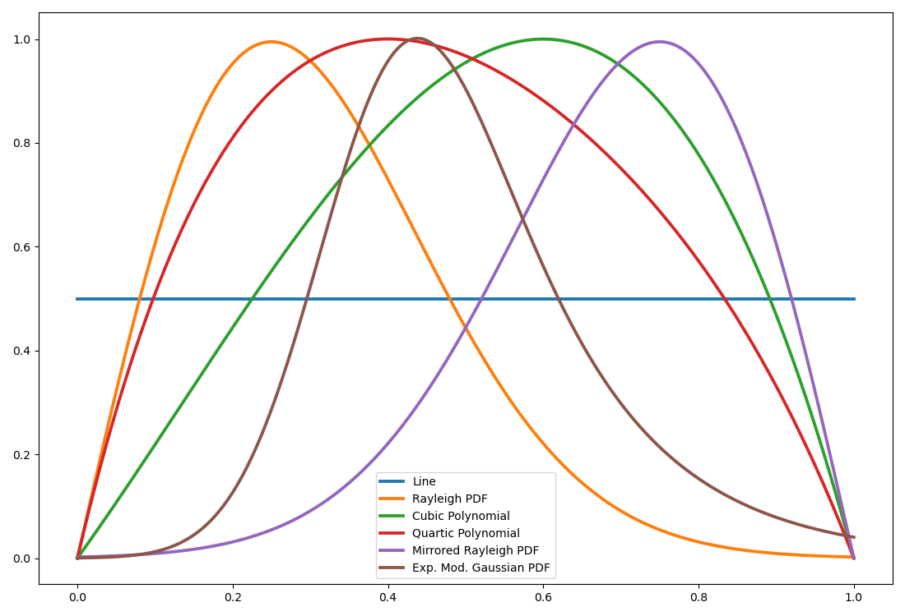
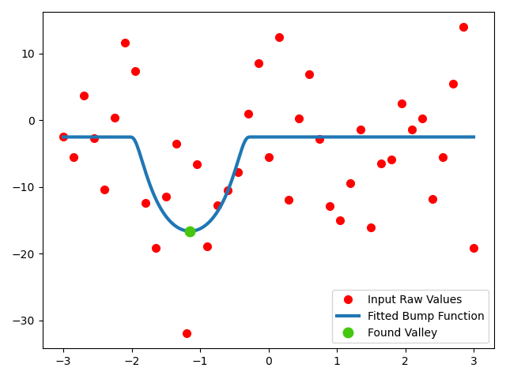

# peakfitpy

Python package for comparing curve models fitted to 1D sampled data and estimating the position and width
of a single peak or valley when the selected model supports these properties.

### Why this package?

A measured peak does not always follow a Gaussian profile. This package provides a common interface for comparing several curve shapes and retrieving the properties of the selected fit. It is intended for data containing a single feature of interest; overlapping peaks are not fitted as a sum of separate components.

### Features

- Automatic comparison of 18 implemented curve models, including Gaussian, Lorentzian, Moffat, Rayleigh and polynomial functions;
- Peak and valley fitting for supported models;
- Automatic input data preparation (normalization) and conversion of peak coordinates and width back to the original units;
- Analytical full width at half maximum (FWHM) for supported profiles;
- Optional filters for poorly sampled peaks and peak fits that perform worse than a line;
- Evaluation and plotting of the selected curve.

### Setup instructions

#### Installation

Planned PyPI installation command (placeholder until `peakfitpy` is published):

```console
python -m pip install peakfitpy
```

To upgrade after publication:

```console
python -m pip install --upgrade peakfitpy
```

Run these commands with the intended Python environment active.

#### Requirements

Python >=3.10, NumPy, SciPy and Matplotlib.

For development, install the optional tools from the repository directory:

```console
python -m pip install -e ".[dev]"
python -m pytest
```

The editable installation (`-e`) lets Python use the source files directly.   
The development tools are `pytest` for tests, `Ruff` for code checks and `mypy` for type checks.

### Examples

#### Minimal example

```python
import matplotlib.pyplot as plt
import numpy as np

from peakfitpy import PeakFit1D
from peakfitpy.fit_models import emg_f

x = np.linspace(-5.0, 5.0, 101)
y = 2.0 + 4.0*np.exp(-((x - 1.4)**2)/(2.0*0.8**2))
y = PeakFit1D.add_awgn(y, noise_fraction=0.028, seed=25)  # Repeatable Gaussian noise

fitter = PeakFit1D(x, y)
fit, peak = fitter.find_best_fit(selection_criterion="IC", exclude_funcs=(emg_f,))  # Compare fits using AICc

if fit is not None:
    print("Selected function:", fit.function.__name__)
    print("Normalized RMSE:", fit.rmse)
    y_fitted = fitter.interpolate_y(x)  # Evaluate in the original X and Y units
    fitter.plot_best_curve()
    plt.show()

if peak is not None:
    print("Peak" if peak.is_peak else "Valley")
    print("Coordinates:", peak.x_orig, peak.y_orig)
    print("FWHM:", peak.fwhm_orig)  # None when this model has no implemented FWHM
```

Example output:

  

#### Selecting candidate functions

```python
from peakfitpy.fit_models import gaussian_leveled_f, lorentzian_f

fit, peak = fitter.find_best_fit(
    include_funcs=(gaussian_leveled_f, lorentzian_f),  # Compare only these models
    selection_criterion="IC",
)

# Alternatively, exclude all polynomial models using exclude_funcs=PeakFit1D.polynomials.
# Supply either include_funcs or exclude_funcs, not both simultaneously.
```

The supported callables and their names are available as `PeakFit1D.functions` and `PeakFit1D.function_names`. 
The constant model is separate from `PeakFit1D.polynomials`.

#### Candidate curve profiles
The following symmetric curve profiles use their default parameters within the normalized X range:

  

The following plots show the generic and asymmetric curve profiles:

  


### Interpretation of fitting results

The input X and Y data are normalized to [0, 1] before fitting. `fit.params`, `fit.pcov`, `fit.perr`, `fit.rmse` and `fit.mae` 
refer to this normalized fit. Use `interpolate_y(x)` for fitted Y values in the original units.

`peak.x`, `peak.y` and `peak.fwhm` use normalized units; their `_orig` counterparts use the original data units. 
FWHM describes the fitted profile at half its height relative to its baseline. For valleys, it describes half the depth. 
It can extend outside the measured interval.

The best fit can be selected using one of these criteria. A residual is the difference between an observed Y value and its fitted value.

- `"RMSE"`: root mean square error, which gives larger residuals more influence;
- `"MAE"`: mean absolute error, which treats residuals linearly and is therefore 
 less sensitive to outliers;
- `"IC"`: corrected Akaike information criterion (AICc), which balances fitting error against the number of function parameters.

All candidates are fitted using least squares, which minimizes the sum of squared residuals, including when MAE is used for ranking. Peak/valley variants and starting guesses
are compared by RMSE within each model. Available criteria can be checked through `fitter.best_fit_criteria`; AICc availability 
is updated for the selected candidates. An unavailable criterion falls back to RMSE with a warning.

SciPy's `curve_fit` returns the parameter covariance estimate, `fit.pcov`. The package calculates `fit.perr` as
the square roots of the diagonal entries of `fit.pcov`.
They describe approximate uncertainty in the fitted parameters, not uncertainty intervals for the peak position or FWHM. Polynomial fits currently return 
`None` for both fields.

### Limitations

#### Fitting noise-only data

The following example fits candidate models to noise-only data:

```python
# Fit the candidate models to noise-only data and plot the best fit.
x = np.linspace(-3.0, 3.0, 41)
# Gaussian noise around a constant baseline; no underlying peak or valley.
y = 12.0*np.random.default_rng(0).normal(0.0, 1.0, x.size) - 4.0

pf = PeakFit1D(x, y)
fit, peak = pf.find_best_fit(selection_criterion="IC", filter_spikes=True,
                             filter_line_fit=True, plot_best_fit=True)
# A returned peak or valley describes the fitted curve; it does not prove a real feature exists.
print(peak)
```

Example output: 

  

The package estimates the properties of a fitted peak or valley. It does not determine whether an underlying peak or valley is present in the signal. Random noise can produce a fitted peak or valley, even with the optional filters enabled.

### Input requirements and limitations

- Provide equally sized, finite, real arrays with at least two samples. One-column arrays are also accepted. X values must be unique; 
X and Y must both be non-constant. If X values are unsorted, they are sorted together with their corresponding Y values.
- Models with more parameters than samples are skipped. The best numerical fit does not necessarily have a definable peak; `peak` can be `None` even when `fit` exists.
- Nonlinear fitting depends on initial estimates and parameter bounds. The selected result is the best of the successful candidates, without a guarantee of the global optimum.
- Width and baseline bounds constrain the available shapes. Nonuniform sampling also affects the initial width estimates; each sample receives equal weight in fitting.
- FWHM is not implemented for polynomial, constant, line or exponentially modified Gaussian models.
- Setting `filter_spikes=True` removes eligible peaks with fewer than three nearby samples, or with a sufficiently high ratio of local to total RMSE. `filter_line_fit=True` performs its additional comparison only when a line has not already been fitted. These filters are practical screening rules, not statistical significance tests; a returned peak does not establish that a real feature is present.
- A failed repeated search can retain and return earlier successful fits, with a warning.
- `interpolate_y` evaluates within the original X interval; extrapolation (for values out of initial range) is rejected.

### Documentation and feedback

The docstrings describe the public methods and model parameters. Report problems through the [issue tracker](https://github.com/sklykov/peakfit/issues), preferably with a small input example and the selected fitting options.

See the [API reference](./docs/api/index.html) for the main fitting class.

See [CHANGELOG.md](CHANGELOG.md) for the change history.

### License

MIT; see [LICENSE](LICENSE).


